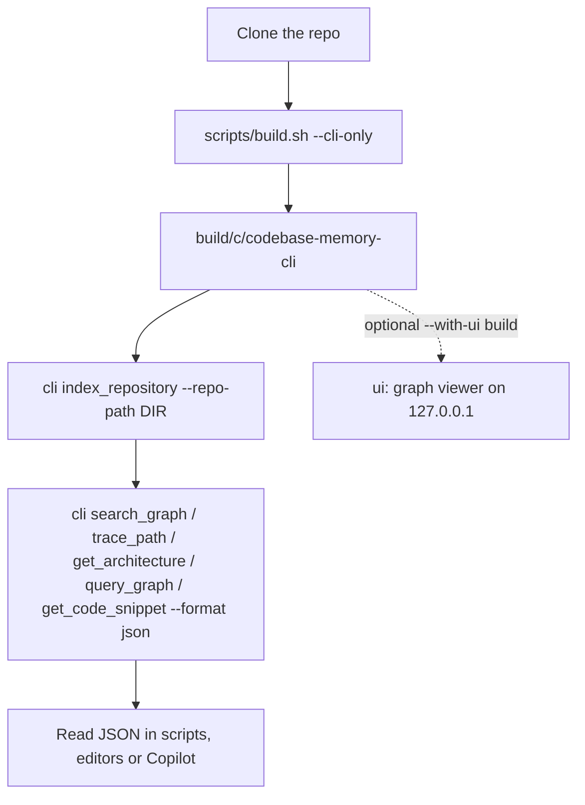

# Codebase Memory CLI: Build & Run Guide

This guide covers building the fork's `codebase-memory-cli` binary from source, indexing a
repository, and reading the JSON it prints. For the shortest path, see
[CLI_QUICKSTART.md](./CLI_QUICKSTART.md). For GitHub Copilot, see
[COPILOT_CLI_INTEGRATION.md](./COPILOT_CLI_INTEGRATION.md).

> **This is the CLI-only fork: no MCP, no daemon, no network.** See "About this fork" in the
> top-level [README](../README.md). The code is pure C11 (there is no Go toolchain). All
> third-party code is vendored and compiled in.

## Process overview



## 1. Prerequisites

- A C11 compiler (clang or gcc), `make` and `git`.
- `node`, and an existing `graph-ui/node_modules`, **only** for the optional UI build.
- No network access is needed to build or run.

You can also use the bundled dev container. VS Code and JetBrains IDEs detect
`.devcontainer/devcontainer.json`, and the workspace is mounted at `/workspace`.

## 2. Build

| Command | Output |
|---|---|
| `scripts/build.sh --cli-only` | `build/c/codebase-memory-cli`: no MCP, no daemon, no HTTP server |
| `scripts/build.sh --cli-only --with-ui` | The same binary name, plus the `ui` command (127.0.0.1 only) |
| `make -f Makefile.cbm test-cli-only` | Smoke test and install/uninstall round-trip for the CLI-only binary |
| `make -f Makefile.cbm verify-cli-only-link` | Checks that no MCP router or daemon symbols are linked |

`scripts/build.sh` with no flags still builds the upstream `codebase-memory-mcp` binary. This fork
does not ship that binary.

## 3. Command shape

```text
codebase-memory-cli --help                         list commands and tools
codebase-memory-cli cli [--quiet] <tool> [--flag value ...] [--format json]
codebase-memory-cli cli <tool> --help              flags for one tool
codebase-memory-cli ui [--port N] [--format json]  graph UI (UI builds only)
codebase-memory-cli install [--project DIR]        Copilot command files (see Copilot guide)
codebase-memory-cli uninstall --copilot [--project DIR]
```

- `--format json` is a **per-tool** flag. It gives one stable JSON document on stdout. The default
  `tree` format is a compact text form meant for people.
- `index_repository`, `compare_graphs`, `delete_project` and `ingest_traces` always print JSON and
  reject `--format`.
- `--quiet` (before the tool name) silences progress and warnings on stderr.
- `cli --json <tool>` prints the raw result envelope (`content`, `structuredContent`, `isError`).
  Scripts should prefer `--format json`.
- `scripts/cbm <tool> [flags]` runs `codebase-memory-cli cli --quiet <tool> [flags] --format json`.
  It finds the binary through `$CBM_BIN`, then `PATH`, then `build/c/`.

## 4. Index and query

```text
codebase-memory-cli cli --quiet index_repository --repo-path /path/to/repo [--name NAME]
codebase-memory-cli cli list_projects --format json
codebase-memory-cli cli search_graph --project NAME --name-pattern 'regex' --format json
codebase-memory-cli cli trace_path --project NAME --function-name FN --direction inbound --format json
codebase-memory-cli cli get_architecture --project NAME --format json
codebase-memory-cli cli query_graph --project NAME --query 'MATCH ... RETURN ...' --format json
codebase-memory-cli cli get_code_snippet --project NAME --qualified-name QN --format json
```

The project name defaults to a form of the repository path (`/home/me/app` becomes
`home-me-app`). `list_projects` shows it.

## JSON output reference

All examples below were captured from the two-function demo in the quickstart (`main.c`, where
`main` calls `compute` and `compute` calls `add`), indexed with `--name demo`. Only absolute paths
were shortened. `scripts/verify-docs.sh` re-runs each command marked `json-example` and checks that
the keys and value types still match.

### `index_repository`

<!-- json-example: index_repository --repo-path "$DEMO" --name demo -->
```json
{"project":"demo","excluded":{"dirs":[".git"],"count":1,"truncated":false},"not_indexed_files_count":0,"skipped_count":0,"parse_partial_count":0,"parse_unusable_count":0,"nodes":7,"edges":8,"expected_nodes":7,"expected_edges":8,"adr_present":false,"adr_hint":"Project indexed. Consider creating an Architecture Decision Record: ...","artifact_present":false,"status":"indexed"}
```

### `list_projects`

<!-- json-example: list_projects -->
```json
{"projects":[{"name":"demo","root_path":"/path/to/demo","branch":"main"}],"total":1,"offset":0,"limit":50,"returned":1,"has_more":false}
```

### `search_graph`

Results are grouped by file. The qualified name of each row is `qn_prefix + "." + name`, and the
`cols` array names each position in `rows`.

<!-- json-example: search_graph --project demo --name-pattern compute -->
```json
{"qn_rule":"qn = qn_prefix == \"\" ? name : qn_prefix + \".\" + name","cols":["name","label","lines","in","out"],"groups":[{"qn_prefix":"demo.main","file":"main.c","rows":[["compute","Function","5-5",1,1]]}],"total":1,"returned":1,"count":1,"has_more":false,"truncated":false}
```

### `trace_path`

`hop` is the call distance from the traced function: `compute` calls `add` directly, and `main`
reaches it through `compute`.

<!-- json-example: trace_path --project demo --function-name add --direction inbound -->
```json
{"function":"add","direction":"inbound","callers_total":2,"callers_total_relation":"eq","callers":{"qn_rule":"qn = qn_prefix == \"\" ? name : qn_prefix + \".\" + name","cols":["name","hop"],"groups":[{"qn_prefix":"demo.main","rows":[["compute",1],["main",2]]}]}}
```

### `get_architecture`

<!-- json-example: get_architecture --project demo -->
```json
{"project":"demo","aspects_hint":"Summary view (default). ...","total_nodes":7,"total_edges":8,"node_labels":{"cols":["label","count"],"rows":[["Function",3],["Branch",1],["File",1],["Module",1],["Project",1]]},"edge_types":{"cols":["type","count"],"rows":[["DEFINES",4],["CALLS",2],["CONTAINS_FILE",1],["HAS_BRANCH",1]]},"languages":{"cols":["language","files"],"rows":[["C",1]]},"packages":{"cols":["name","nodes","fan_in","fan_out"],"rows":[["main",3,0,0]]},"entry_points":{"cols":["qn","file"],"rows":[["demo.main.main","main.c"]]}}
```

### `query_graph`

<!-- json-example: query_graph --project demo --query 'MATCH (f:Function)-[:CALLS]->(g:Function) RETURN f.name, g.name' -->
```json
{"columns":["f.name","g.name"],"rows":[["compute","add"],["main","compute"]],"returned":2,"total":2,"total_relation":"eq","has_more":false,"truncated":false}
```

### `get_code_snippet`

<!-- json-example: get_code_snippet --project demo --qualified-name compute -->
```json
{"name":"compute","qualified_name":"demo.main.compute","label":"Function","file_path":"/path/to/demo/main.c","start_line":5,"end_line":5,"source_mode":"full","source":"int compute(int x) { return add(x, 1); }\n","match_method":"suffix","callers":1,"callees":1}
```

### Errors

A tool error prints one JSON object with an `error` string on **stderr** (stdout stays empty),
usually with a `hint`, and exits with status **1**:

<!-- json-example: search_graph --project no-such-project --name-pattern x -->
```json
{"error":"project not found or not indexed","hint":"Use list_projects to see all indexed projects, then pass it as the \"project\" argument.","available_projects":["demo"],"count":1}
```

Errors in the command line itself (an unknown tool, an unknown flag or a missing required flag) are
printed as plain text on **stderr**, with exit status 1:

```text
$ codebase-memory-cli cli nope_tool
unknown tool: nope_tool
$ codebase-memory-cli cli search_graph --bogus 1
error: unknown flag --bogus for this tool — run 'cli search_graph --help' for the supported flags
```

Fork-level refusals (`update` is not available in this build, exit 1) print `{"error":"..."}` on stdout.
`ui` uses a nested object, and its exit status is 2:

```text
$ codebase-memory-cli ui --format json        # plain --cli-only build
{"error":{"code":"ui_not_built","message":"built without UI; rebuild with scripts/build.sh --cli-only --with-ui"}}
```

## 5. Graph UI (localhost only)

In a `--with-ui` build:

```text
$ codebase-memory-cli ui --port 0 --format json
{"status":"listening","url":"http://127.0.0.1:54321"}
```

Without `--port`, the UI uses port 9749, and without `--format json` it prints a one-line text
message. It binds `127.0.0.1` only, and no option changes the interface. It runs in-process only
while the command runs; Ctrl-C stops it. It rejects foreign `Host` and `Origin` headers. A busy
port prints `{"error":{"code":"port_in_use",...}}` and exits non-zero.

You never need the UI. Every UI capability has a CLI command:

| UI capability | CLI command |
|---|---|
| Browse projects | `cli list_projects` |
| Browse / search the graph | `cli search_graph`, `cli query_graph` |
| Graph / layout data | `cli query_graph`, `cli get_architecture`, `cli get_graph_schema` |
| Node details / source | `cli get_code_snippet` |
| Index a repository | `cli index_repository` |
| Index status, project health | `cli index_status` |
| Delete a project | `cli delete_project` |
| ADR read / write | `cli manage_adr` |
| Processes (indexing progress) | `cli --progress index_repository` |
| Logs | `cli --verbose <tool>` (stderr) |

## Notes

- The binary makes **no outbound network connections**: no update checks and no telemetry.
  `make -f Makefile.cbm verify-cli-only-no-http` checks that the plain binary imports no socket or
  resolver functions.
- Every command runs once and exits. There is no background service to start or stop.
- `--help` is the source of truth for tool names and flags.
